# 2025-group-8

# Table of Contents

- [Introduction](#introduction)
  - [Our Game](#our-game-video)
  - [Our Group](#our-team-members)
  - [Inspiration Mining](#inspiration-mining)
  - [Prototype Videos of Two Ideas](#prototype-videos-of-two-initial-ideas)
  - [Prototype Video of Final Idea](#prototype-video-of-final-idea)

- [Requirements](#requirements)
  - [Stakeholder list](#stakeholder-list)
  - [Epics & User Stories](#epics--user-stories)
  - [Reflection](#reflection)

- [Design](#design)
  - [Class Diagram](#class-diagram)
  - [Sequence Diagram: Chapter Level Logic](#sequence-diagram-chapter-level-logic)
  - [Sequence Diagram: Early Sketch](#sequence-diagram-early-sketch)

- [Implementation](#implementation)
  - [Technical Challenge 1: Cross-Platform Implementation](#technical-challenge-1-cross-platform-implementation)
  - [Technical Challenge 2: Collision Mechanism Design](#technical-challenge-2-collision-mechanism-design)
  - [Technical Challenge 3: Progressive Level Design](#technical-challenge-3-progressive-level-design)

- [Evaluation](#evaluation)
  - [Qualitative: Think-Aloud Usability Testing](#qualitative-think-aloud-usability-testing)
  - [Heuristic Evaluation Report: Iron Rebellion](#qualitative-heuristic-evaluation)
  - [Quantitative: NASA TLX Workload Analysis](#quantitative-nasa-tlx-workload-analysis)
  - [Quantitative: Game Difficulty and Usability Assessment](#quantitative-game-difficulty-and-usability-assessment)
  - [Code Testing](#6-code-testing)

- [Process](#process)
  - [Our Progress](#our-progress)

- [Sustainability, Ethics, and Accessibility](#8-sustainability-ethics-and-accessibility)
  - [Environmental](#environmental)
  - [Social](#social)
  - [Individual Well-being](#individual-well-being)
  - [Sustainability Impact Assessment](#sustainability-impact-assessment)
  - [Green Foundation Implementation Patterns Analysis](#green-foundation-implementation-patterns-analysis)

- [Conclusion](#9-conclusion)

- [Contribution](#contribution)

---

# Project Report: Iron Rebellion

> *"By seeing the dog's posittion, you can know what progress you are 👇"*

## 1. Introduction

- Iron Rebellion is a 2D platformer featuring hand-crafted levels, distinctive oil-painting visuals, and a story that progresses through gameplay. With steadily increasing difficulty and four visually distinct chapters, the game guides players through environments such as underground cities, lush jungles, and war-torn ruins.

- The visuals have a unique oil painting style, like a blend of old-school art and modern gameplay. It’s got that artistic feel without being too heavy, and with features like adjustable difficulty and smart enemy AI, it’s both challenging and accessible.

- What really makes *Iron Rebellion* stand out is how naturally it ties the story into the gameplay. You’re not just jumping through levels，actually you’re pushing the story forward. Each stage has purpose, not just action for the sake of action.

---

### Our Game Video

> *"I hope that our video could give you a comprehensive understanding of our game."* 

> *"City of underground, adventure in jungle, war in ruins, destory the pivot - 4 chapters lead you in a world of Iron Rebellion!"*

[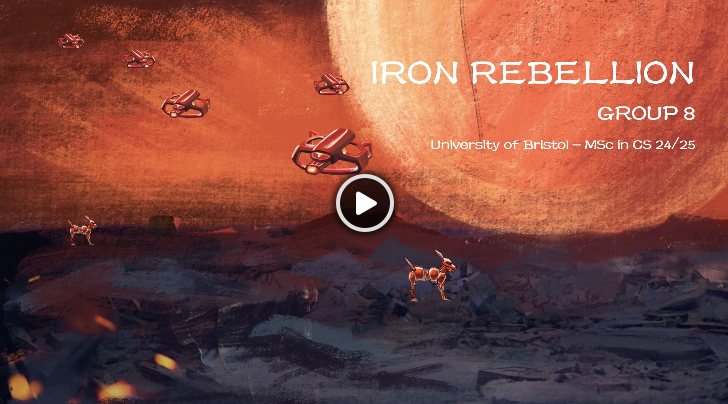](https://drive.google.com/file/d/14OzUzU3QxR_EjTLvqBnGxJBfApoTYgf7/view?usp=sharing)

---

### Our Team Members

> *"Want to know who made this excellent game? Here we are 👇"* 

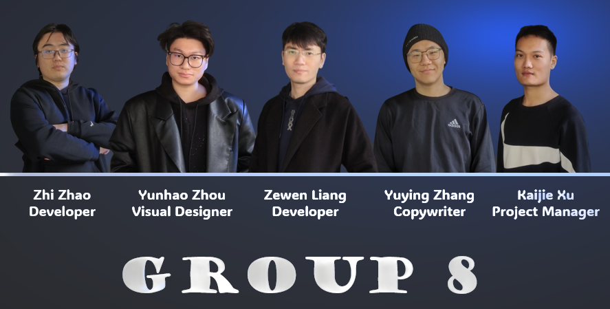

| | Name | Email | Role | Github Account|
|:---|:---|:---|:---| :---|
| 1 | Zewen Liang | je24595@bristol.ac.uk | Developer | liangzw0126 |
| 2 | Yunhao Zhou | bx24770@bristol.ac.uk | Visual Designer | YonasZhou |
| 3 | Yuying Zhang | bc24261@bristol.ac.uk | Copywriter | X65060782 |
| 4 | Zhi Zhao | ug23003@bristol.ac.uk | Developer | ZZ1975 |
| 5 | Kaijie Xu | hb24857@bristol.ac.uk | Project Manager | kkkkkaneeeee |

> *"Everyone has their own value, and everything has its proper use."*

Not everyone in our team excels at programming, but each member has their own strengths. This is the guiding principle behind our team's division of tasks—leveraging each person's expertise to work efficiently together.

## 2. Requirements

The foundation of Iron Rebellion was built within a clear requirements engineering framework to avoid issues like feature creep and unclear scopes. We used tools like Miro and Google Docs to brainstorm with the team and decide on the features that would matter most to players.

At first, we had two ideas: a fantasy puzzle platformer and an adventure game with mechanical hazards. In the end, the team voted for the latter, which eventually became Iron Rebellion. This direction gave us a lot of creative freedom to craft a fun, modular gameplay experience.

We used user stories and use case diagrams to map out player interactions, from starting the game and navigating menus to triggering switches and completing levels. For example:

> *"As a casual gamer, I want an easy mode so I can enjoy the game without frustration."*

> *"As a player, I want the game to auto-save my progress so I don’t lose my place."*

To ensure clear implementation, we set acceptance criteria. We also created paper prototypes and small technical demos to test feasibility. Level design was tested using tile-based systems, and feedback from lecturers and TAs helped us refine player-centered stories.

Our MVP included handcrafted levels, four difficulty settings, and the core game design.

---

### Inspiration Mining

First, through a brainstorming session within the team, each member contributed two game ideas, as shown in the table below:

| Game Name                  | Game Type                          | Mechanics                                                                                                                                                                                                                     | Reference |
|---------------------------|------------------------------------|-------------------------------------------------------------------------------------------------------------------------------------------------------------------------------------------------------------------------------|-----------|
| Super Mario               | Role-playing, Adventure, 2D        | Jump on platforms/enemies, avoid attacks, move right, single-exit levels, time limit.                                                                                                                                        | [Link](https://en.wikipedia.org/wiki/Super_Mario) |
| Metal Slug                | Run and gun                        | Movement and cover generate Dodge Points to reduce/cancel damage.                                                                                                                                                            | [Link](https://en.wikipedia.org/wiki/Metal_Slug) |
| Stardew Valley            | Farming Simulation / RPG           | Manage farm, crops, animals, fishing, mining, crafting, combat, relationships.                                                                                                                                               | [Link](https://en.wikipedia.org/wiki/Stardew_Valley) |
| Cuphead                   | Run-and-Gun / Platformer           | Hand-drawn art, boss fights, challenging platforming with precise timing.                                                                                                                                                    | [Link](https://en.wikipedia.org/wiki/Cuphead) |
| GRIS                      | Adventure, Platformer              | Exploration and light puzzles with emotional narrative and evolving abilities.                                                                                                                                               | [Link](https://store.steampowered.com/app/683320/GRIS/) |
| Slay the Spire            | Roguelike, Deck-Building           | Build a card deck to defeat enemies while climbing a spire, high replayability.                                                                                                                                              | [Link](https://store.steampowered.com/app/646570/Slay_the_Spire/) |
| Factorio                  | Real-time strategy, Simulation     | Build automated factories, manage logistics/defenses, optimize production.                                                                                                                                                   | [Link](https://store.steampowered.com/app/427520/Factorio/) |
| Sword and Fairy           | Role-Playing Game (RPG)             | Turn-based combat, puzzle-solving, emotional storyline rooted in Chinese folklore.                                                                                                                                           | [Link](https://store.steampowered.com/app/1546570/_/) |
| Winter Dodge              | Skill > One-button                 | Auto-skiing game, change direction, get close to trees for score bonuses.                                                                                                                                                    | [Link](https://www.coolmathgames.com/0-winter-dodge) |
| Suika Watermelon Game     | Strategy > High Score Games        | Merge fruits for higher scores, limited pushes, avoid box overflow.                                                                                                                                                          | [Link](https://en.wikipedia.org/wiki/Suika_Game) |

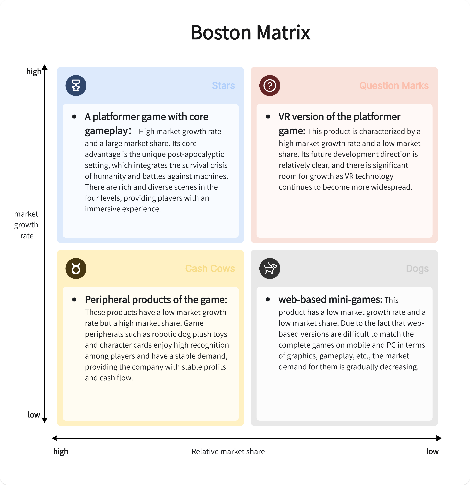

We used the Boston Matrix to categorize all games into four types. Each type has a corresponding implementation method. Finally, we chose the most suitable gray area to implement, resulting in two prototypes.

---

### Prototype Videos of Two Initial Ideas

Next, through a team vote, we selected the two most popular game ideas as our preliminary concepts:

- **Super Mario:** 
a landmark platformer with carefully designed levels that challenge players' skills. Known for its responsive controls and physics engine, the game features a power-up system and varied enemies that add depth. It also includes puzzle elements and cooperative multiplayer, expanding gameplay beyond traditional platforming.

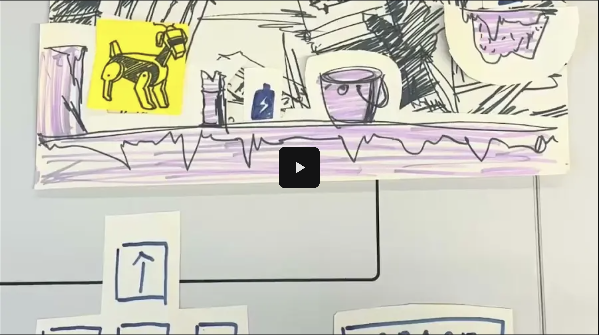

- **Merge Big Watermelon:** 
a casual puzzle game where players merge items on a grid to create larger ones, aiming for the biggest watermelon. With its minimalist, colorful design and cross-platform compatibility, the game’s easy to play yet increasingly challenging.

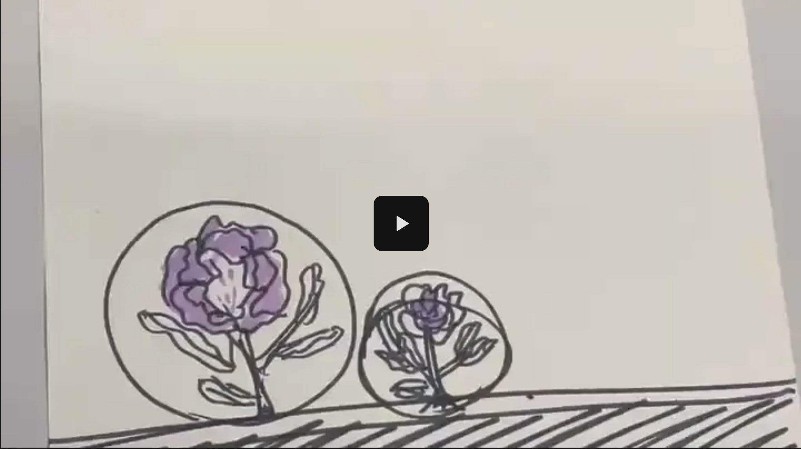

---

### Prototype Video of Final Idea

Finally, after a thorough discussion and a technical feasibility analysis, we finalized our concept:

We decided to use *Super Mario* as a model, enhancing the game's fun by adjusting the theme, introducing more characters, and other elements, ultimately shaping our game.

[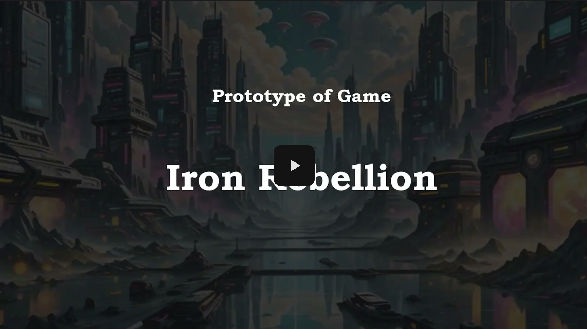](https://drive.google.com/file/d/1-vzK08G26HvWcuNe7zErzPBMIJYnoJdl/view?usp=sharing)

---

### Stakeholder list

In the requirements gathering phase, we identified the stakeholders of our game.

- **Players:** End users who will interact with and enjoy the game.
- **Game Developers:** Team members responsible for game design, coding, and testing.
- **Graphic Designers:** Individuals tasked with creating the visual elements of the game.
- **Sound Engineers:** Professionals creating and integrating sound effects and music.
- **Marketing Team:** Personnel focused on promoting the game to increase visibility and engagement.
- **Game Reviewers and Bloggers:** Key influencers who will help shape public perception of the game.
- **Lecturers and TAs:** Academic supervisors and teaching assistants who provide guidance, monitor project progress, and ensure the game development aligns with academic standards and learning outcomes.
> *"Definitely, Lecturers and TAs are our super first priority! 😝"*

---

### Epics & User Stories

And we listened to our stakeholders' voice:

| Stakeholder            | Epic                                        | User Story                                  | Acceptance Criteria |
|------------------------|---------------------------------------------|---------------------------------------------|---------------------|
| **Players**            | **Player Experience Enhancement**           | As a player, I want the game to offer at least three difficulty settings: Easy, Medium, and Hard, so that I can enjoy the game at a pace suitable for my skill level. | Given the game's settings menu, when I select a difficulty setting, then the game's speed and obstacle density should adjust accordingly. |
| **Players**            | **Player Experience Enhancement**           | As a player, I want a system of achievements and rewards for completing levels without failing, collecting all items, or achieving high scores, so that I feel recognized for my accomplishments and stay engaged with the game. | Given I meet specific game milestones, when these conditions are met, then rewards such as new character skins or special abilities should be unlocked. |
| **Game Developers**    | **Developer Efficiency and Collaboration**  | As a game developer, I want to use a game development platform that integrates with popular version control systems and supports automated testing tools, so that I can implement features quickly and with fewer bugs. | Given the development platform, when I deploy new code, then it should seamlessly integrate with version control and trigger automated tests. |
| **Game Developers**    | **Developer Efficiency and Collaboration**  | As a game developer, I want tools that support real-time collaboration, allowing multiple users to edit the same files without conflicts, so that the team can work together seamlessly regardless of location. | Given a collaborative coding session, when multiple developers make changes, then all changes should be visible in real-time without conflicts. |
| **Lecturers and TAs** | **Ensuring Academic and Technical Standards** | As a lecturer or TA, I want access to project updates and documentation so that I can provide timely feedback and ensure the game development process meets academic standards and learning objectives. | Given regular project updates, when I review the documentation and prototype builds, then I should be able to assess alignment with course goals and provide constructive advice.
| **Lecturers and TAs** | **Supporting Student Learning and Development** | As a lecturer or TA, I want students to demonstrate iterative improvements based on feedback, so that I can assess their ability to adapt, reflect, and apply good software engineering practices. | Given feedback sessions, when I observe successive project iterations, then I should see visible improvements and proper incorporation of suggested changes.
| **Marketing Team**     | **Effective Player Engagement and Marketing** | As a marketing team member, I want to conduct targeted marketing campaigns using player data to segment audiences effectively, so that we can reach the right audience and maximize engagement. | Given player demographic and preference data, when I segment this data for a campaign, then the marketing tools should allow for targeted promotions. |
| **Marketing Team**     | **Effective Player Engagement and Marketing** | As a marketing team member, I want the game to have social media integration, allowing players to connect their accounts and share achievements, so that gameplay achievements can organically drive traffic and downloads. | Given the social media feature, when a player achieves a milestone and chooses to share it, then the share should include a link to the game’s download page. |
| **Game Reviewers and Bloggers** | **Enhancing Game Visibility and Credibility** | As a game reviewer or blogger, I want early access to game builds and detailed release notes at least one month before the official launch, so that I can review and provide informed feedback, helping to build anticipation and inform potential players. | Given early access, when I review the game and communicate feedback, then it should be considered for improvements before launch. |
| **Game Reviewers and Bloggers** | **Enhancing Game Visibility and Credibility** | As a game reviewer or blogger, I want exclusive access to interviews with the development team and behind-the-scenes content, so that I can create engaging content that provides deeper insights into the game development process. | Given access to the development team, when I conduct interviews or receive content, then it should be detailed and suitable for direct embedding in posts. |

This is our user journey map!

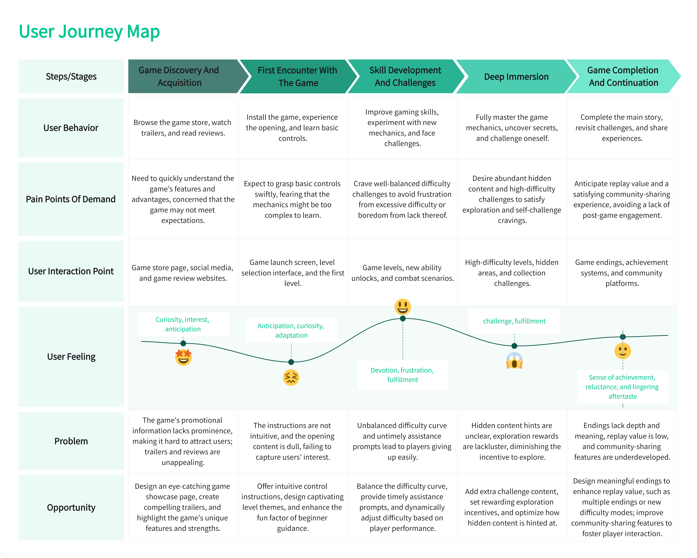

---

### Reflection

- During the development of our game, our team deepened our understanding of agile development practices, focusing on **epics**, **user stories**, and **acceptance criteria**.

- The This was our first time systematically applying software engineering principles to guide the development of a software project. Throughout the process, we learned each step of requirements gathering, which greatly contributes to our future career development.

- This experience not only improved our product's alignment with user expectations but also refined our project management skills, emphasizing the importance of clear, user-focused, and detailed planning in software development.

## 3. Design

To support modularity and future expansion, Iron Rebellion follows p5.js original architecture: each visual object has an draw() method, which makes the whole structure consistent. The **gameObject** superclass encapsulates common properties like position, velocity, and size, and is extended by interactive objects like **robotDog**, **enemy**, and **platform**.

- **robotDog** handles input and physics.
- **chapterSelector** loads levels from text files and manages collision resolution.
- **picturesLoader** coordinates game modes, UI elements, and audio.

This architecture made the game easy to iterate and test. Visual aids, including sequence and state diagrams, helped clarify object interactions. 

---

### Class Diagram

Class diagram shows the structure of the project. 

> *"We designed this diagram with [draw.io](https://app.diagrams.net/)."*

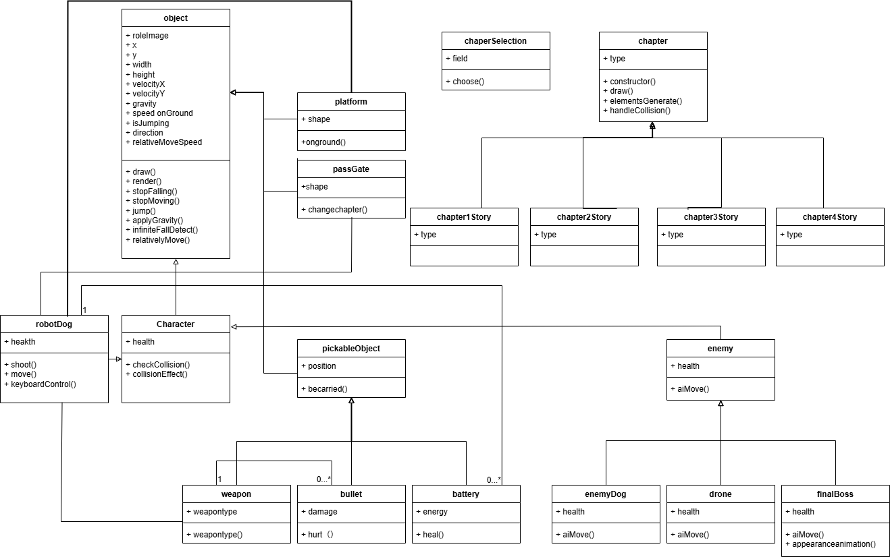

---

### Sequence Diagram: Chapter Level Logic

We improved performance by introducing spatial partitioning in collision detection. Behavioral diagrams like the Player State Diagram ensured accurate transitions and reduced bugs like double jumps. 

> *"We designed this diagram with [plantuml](https://www.plantuml.com/plantuml/umla)."*

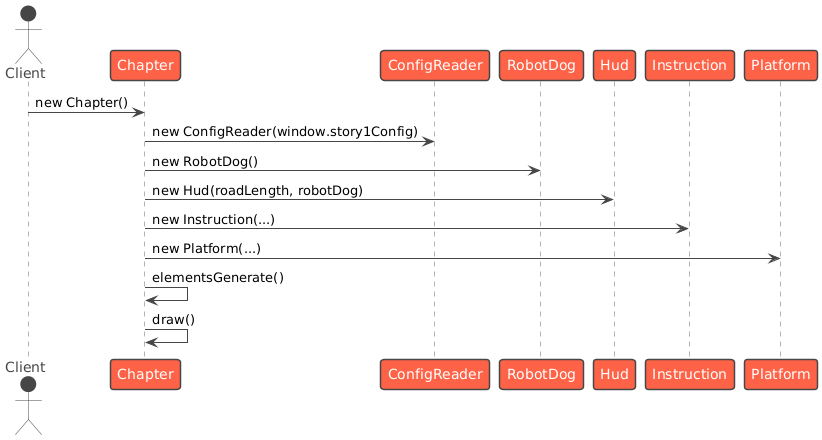

---

### Sequence Diagram: Early Sketch

Overall, the evolving design documentation served as a living reference, keeping team members aligned during agile development sprints.

> *"We designed this diagram with [plantuml](https://www.plantuml.com/plantuml/umla)."*

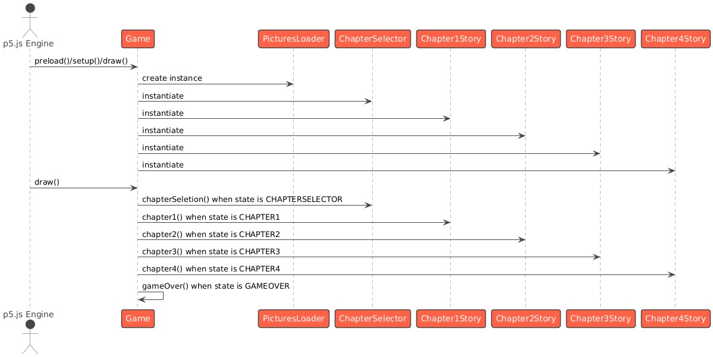

## 4. Implementation

We implemented *Iron Rebellion* in layers, starting with a playable prototype. The **gameObject** base class unified behavior across interactive elements, with subclasses overriding specific logic.

The **chapterSelector** dynamically generated levels using character-mapped text files, enabling rapid level design changes. Early movement bugs (e.g., infinite jumps, wall clipping) were resolved through refined velocity and jump logic in **robotDog**.

---

### Three Technical Challenges

- #### Technical Challenge 1: Cross-Platform Implementation

| Section                   | Description |
|---------------------------|--------------------|
| **I. Relative Size**       | Game assets scale proportionally to screen size, ensuring consistent visuals and interaction across devices. |       |
| **II. Access Device Model** | Device detection enables touch gestures on mobile and full keyboard support on desktop for better accessibility. |       |
| **III. Virtual Keyboard**   | A touch-optimized virtual controller appears on mobile devices to ensure full gameplay without physical keyboards. |       |
| **Impact**                 | Cross-platform support enhances accessibility, usability, and reach, creating a seamless experience across all devices. |       |

- #### Technical Challenge 2: Collision Mechanism Design

| Section                     | Description |
|-----------------------------|--------------------|
| **I. Boundary Determination** | Defined precise hitboxes to prevent visual bugs like floating or clipping into platforms. |       |
| **II. Collision Detection**   | Replaced brute-force checks with grid-based filtering to improve performance and responsiveness. |       |
| **III. Different Behaviors**  | Used a behavior handler to define custom responses for different objects like platforms, hazards, and triggers. |       |
| **Impact**                   | Improved physics accuracy and laid groundwork for adding new interactive elements. |       |

- #### Technical Challenge 3: Progressive Level Design

| Section                                | Description                                                                                              |
|----------------------------------------|----------------------------------------------------------------------------------------------------------|
| **I. Incremental Difficulty**          | Increased level challenge by adding more enemies and tighter platform arrangements.                      |
| **II. Scene Variation and Atmosphere** | Each level has unique visuals and themes to maintain engagement and signal progression.                  |
| **III. Boss Integration**              | Final level features a static-phase boss requiring precise control under pressure.                       |
| **Impact**                             | Balanced difficulty with accessibility through thoughtful layout, enemy density, and visual progression. |

## 5. Evaluation

Our evaluation used a combination of qualitative and quantitative techniques to ensure usability and fun across difficulty levels.

---

### Qualitative: Think-Aloud Usability Testing
We conducted think-aloud tests with eight players, revealing UI and collision issues. Fixes included adding pause/reset options and refining platform boundaries. Testers appreciated level clarity and responsive checkpoints.

#### Tasks
- Complete Level 1 from the main menu.
- Attempt to return to the main menu mid-level.

#### Key Observations

| **Issue**                      | **Description**                                                                 | **Participant Feedback**                  |
|---------------------------------|---------------------------------------------------------------------------------|-------------------------------------------|
| **Collision Detection Issues**  | Participant encountered "invisible walls" near platforms, causing confusion.    | "Why am I bouncing off nothing here?"     |
| **Missing Return Functionality**| No option to exit mid-level; participant tried ESC/UI buttons unsuccessfully.    | "Do I have to close the game?"            |
| **Oversized Obstacles**         | Large obstacles trapped the player, forcing respawns.                            | "This rock is way too big—I'm stuck!"    |
| **Repetitive Level Design**     | Levels 1 and 2 felt identical except for backgrounds, with no mechanical variation. | "Where's the challenge?"                |
| **Unlimited Respawns**          | Infinite retries reduced stakes; no game-over system observed.                  | "No stakes—boring!"                      |
| **Predictable Enemy AI**        | Drones followed simple, easily avoidable paths.                                  | "Too easy to dodge."                     |

#### Critical Issues

| **Category**         | **Issue**                                      | 
|----------------------|------------------------------------------------|
| **Urgent Fixes**     | Broken collision detection.                    |
|                      | Lack of pause/return menu disrupts core usability. |
| **Design Weaknesses**| Repetitive levels.                             |
|                      | Oversized obstacles.                           |
|                      | Trivial enemy behavior lowers engagement.      |
| **Missing Systems**  | No difficulty scaling.                         |
|                      | No fail states, harming replayability.         |

#### Recommendations

| **Category**                | **Fixes/Improvements**                                                       |
|-----------------------------|------------------------------------------------------------------------------|
| **Priority Fixes**          | Repair collision detection.                                                  |
|                             | Add a pause/return menu for mid-level navigation.                            |
| **Gameplay Enhancements**   | Resize obstacles to improve movement.                                        |
|                             | Add dynamic elements (e.g., moving platforms).                               |
| **Enemy and Difficulty Improvements** | Introduce tiered difficulty settings.                                 |
|                             | Develop unique enemy behaviors (e.g., ambushes, patrol patterns).            |
| **Progression Systems**     | Implement a game-over state and limited lives.                               |
|                             | Differentiate levels with new mechanics (e.g., environmental hazards, boss fights). |

#### Next Steps

  - Address collision and UI issues as the highest priority.
  - Expand level complexity and improve enemy AI behavior based on user feedback.

---

### Qualitative: Heuristic Evaluation

#### Evaluation Table

| Interface          | Issue                                                                 | Heuristic(s)                                | Frequency (0-4) | Impact (0-4) | Persistence (0-4) | Severity (F+I-P)/3 |
|--------------------|-----------------------------------------------------------------------|---------------------------------------------|------------------|---------------|--------------------|--------------------|
| **Gameplay**       | Broken collision detection ("invisible walls" near platforms).        | Visibility of System Status                 | 4                | 4             | 4                  | 1.33               |
| **UI Navigation**  | No return button to exit levels; players cannot return to main menu.  | User Control and Freedom                    | 3                | 4             | 3                  | 1.33               |
| **Obstacle Design**| Oversized obstacles trap players, forcing respawns.                   | Aesthetic and Minimalist Design             | 3                | 3             | 3                  | 1.00               |
| **Level Design**   | Identical mechanics across 4 levels; only background differences.     | Consistency and Standards                   | 4                | 3             | 4                  | 1.00               |
| **Enemy AI**       | Predictable drone behavior; no difficulty progression.                | Flexibility and Efficiency of Use           | 3                | 3             | 3                  | 1.00               |
| **Game Progression**| No game-over state; unlimited respawns reduce challenge.              | User Control and Freedom, Error Prevention  | 3                | 2             | 4                  | 0.33               |

#### Key Findings  

#### Critical Issues (Severity ≥ 1.33)  
- Collision detection failures disrupt core gameplay.  
- Missing return functionality frustrates navigation.  

#### High-Impact Design Flaws (Severity ~1.00)  
- Oversized obstacles and repetitive level design lower engagement.  
- Simplistic enemy AI lacks challenge.  

#### Moderate Issues (Severity ≤ 0.33)  
- Unlimited respawns reduce stakes but are less urgent.  

#### Recommendations  

| **Category**             | **Fixes/Improvements**                                                           |
|--------------------------|----------------------------------------------------------------------------------|
| **Priority Fixes**       | Fix collision detection to eliminate "invisible walls."                         |
|                          | Add a pause/return menu for mid-level navigation.                               |
| **Design Improvements**  | Resize obstacles; introduce dynamic elements (e.g., moving platforms).          |
|                          | Differentiate levels with unique mechanics (e.g., traps, boss fights).          |
| **Long-Term Enhancements**| Implement difficulty tiers and smarter enemy AI (e.g., patrol patterns).        |
|                          | Add a game-over system with limited lives.                                      |

#### Next Steps  
- Address collision and UI issues first.  
- Then iterate on level complexity and enemy behavior.

---

### Quantitative: NASA TLX Workload Analysis
Ten players rated difficulty variants of Level 1 using NASA TLX. Workload scores increased with difficulty as expected:

- Easy: Lower mental demand and frustration.
- Hard: Higher effort and time pressure, but manageable performance scores.

A Wilcoxon Signed-Rank test (p < 0.01) validated significant differences, confirming successful difficulty scaling.

---

### Quantitative: Game Difficulty and Usability Assessment

#### Objective  
This comprehensive evaluation aimed to assess both the workload and usability experienced by users when playing the first two chapters of our game. While the game does not offer traditional difficulty modes (e.g., Easy, Medium, Hard), it consists of four sequential chapters, each with its own level of challenge. For this study, **Chapter 1** and **Chapter 2** were selected to represent different levels of in-game difficulty.

We utilized the **NASA Task Load Index (TLX)** to measure workload dimensions and the **System Usability Scale (SUS)** to assess overall usability. This dual approach offers a holistic view of how the design and challenge of different chapters impact player experience and satisfaction.

#### Methodology  
The evaluations were conducted in a controlled environment with **ten users**. To minimize learning bias, we employed a **counterbalanced design**:

- Half of the participants played **Chapter 1 first**, followed by Chapter 2.
- The other half played **Chapter 2 first**, then Chapter 1.

After completing each chapter, participants filled out both the NASA TLX and SUS questionnaires. This approach allowed us to accurately capture subjective perceptions of workload and usability after each gameplay session.

#### Statistical Analysis  
To evaluate whether the observed differences between Chapter 1 and Chapter 2 were statistically significant, we conducted a **Wilcoxon signed-rank test**, which is suitable for small sample sizes and non-normal distributions.

- **Test Statistic:** Wilcoxon W = 9  
- **Critical Value (n=10, α=0.05):** 8

Since W > 8, the result is **not statistically significant**.

#### NASA TLX Results  
The following scores represent average user responses on a scale of 0–10:

| Dimension       | Chapter 1 | Chapter 2 |
|----------------|-----------|-----------|
| Mental Demand  | 4.0       | 7.0       |
| Physical Demand| 2.4       | 4.5       |
| Temporal Demand| 4.0       | 6.9       |
| Performance    | 7.0       | 3.3       |
| Effort         | 5.9       | 8.9       |
| Frustration    | 2.9       | 6.8       |

#### SUS Results  

| Chapter    | SUS Score |
|------------|-----------|
| Chapter 1  | 68.8      |
| Chapter 2  | 59.4      |

- **Chapter 1** achieved generally good usability.
- **Chapter 2** showed increased usability challenges, particularly related to complexity and confidence.

#### Discussion  
The combined results suggest:

- **Chapter 1** offers a balanced gameplay experience, with manageable workload and strong usability.
- **Chapter 2**, although more challenging, may benefit from improved design or user interface refinements to reduce cognitive and physical strain.

The increase in perceived workload in Chapter 2 did not lead to a **statistically significant** difference in usability ratings.

#### Statistical Conclusion  
As the **Wilcoxon signed-rank test** yielded a **W value of 9** (above the critical threshold of 8), we **cannot reject the null hypothesis**. This indicates **no significant difference** in SUS scores between Chapter 1 and Chapter 2 at the 0.05 significance level.

#### Conclusion  
This evaluation underscores the importance of careful chapter design as in-game difficulty increases. Even without formal difficulty modes, each chapter introduces challenges that must be balanced to maintain user satisfaction. Future development will focus on refining later chapters to ensure accessibility, engagement, and consistent usability across all gameplay experiences. 

## 6. Code Testing
We used both [**black-box playtesting**](./tests/blackboxTests.js) and a dedicated [**white-box test suite**](./tests/whiteboxTests.js). Key systems tested included:

- Object collisions
- Spawn logic
- Enemy state transitions

Visual QA was handled through manual sprite checks and browser compatibility testing. Every major change was tested on GitHub Pages before deployment.

## 7. Process

Agile workflows defined our production cycle. Roles were assigned based on strengths:

- Developers: Zewen & Zhi
- Designer: Yunhao
- Copywriter: Yuying
- Project Manager: Kaijie

We met in person and online via Microsoft Teams. Day-to-day collaboration was supported via WhatsApp, while **Jira** and **GitHub** tracked tasks and source control.

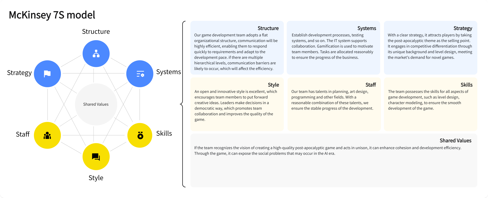

Our team has talents in planning, art design,programming and other fields. With areasonable combination of these talents, weensure the stable progress of the development. The team possesses the skills for all aspects ofgame development, such as level design,character modeling, to ensure the smoothdevelopment of the game.

Key tools:

- **Miro**: Brainstorming, diagrams
- **Procreate & Photoshop**: Visual asset creation
- **Figma**: Interface prototyping
- **Premiere Pro**: Trailer editing
- **Microsoft Forms**: Survey collection

Pull requests were reviewed collaboratively. GitHub Discussions were used to log bugs and suggestions.

We learned to refine task estimates using story points and improved planning across sprints. The team regularly supported each other in testing, optimization, and content polishing.

---

### Our Progress

Kanban Board : [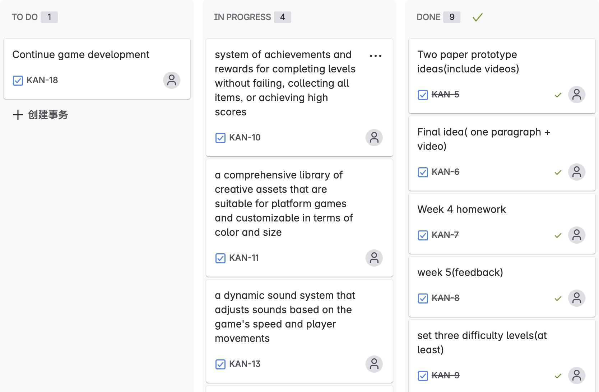](https://kanexu99-1738582319219.atlassian.net/jira/software/projects/KAN/boards/1?atlOrigin=eyJpIjoiNjQxNGNhZDU2NmRmNGNjNTk0YWU3ZGY4NDMzYWE4OTgiLCJwIjoiaiJ9)

## 8. Sustainability, Ethics, and Accessibility

### Key Design Principles

#### Environmental
We minimized carbon impact through digital distribution and asset optimization:

- Lazy-loading  
- Image compression  
- Elimination of unused code  

#### Social
We followed ethical game design:

- No microtransactions or ads  
- High-contrast UI  
- Neutral characters with no cultural bias  

#### Individual Well-being
- Adjustable difficulty  
- Checkpoints and finite levels  
- Prompt reminders for breaks (planned feature)  

These principles guided responsible development and will be expanded in future updates.

---

### Sustainability Impact Assessment

#### Vision and Known Effects

- **Vision:** To deliver a nostalgic, classic gaming experience with a focus on simplicity, fun, and sustainability across modern platforms.

- **Positive:** Uses minimal resources through lightweight design, low hardware demands, and broad device compatibility, reducing environmental impact.

- **Negative:** Potential energy consumption in game playing.

#### Detailed Sustainability Effects
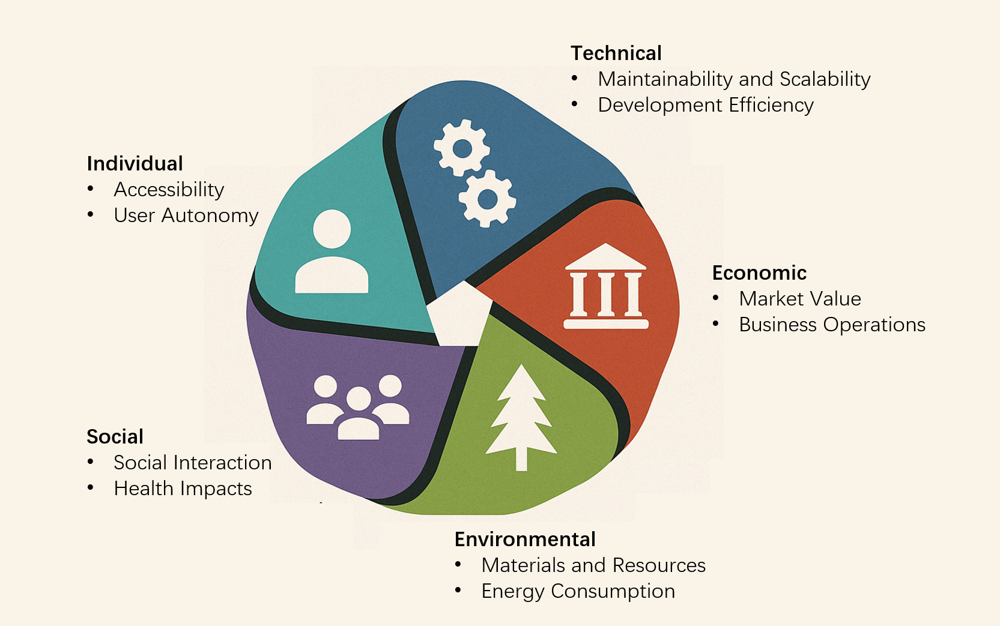

#### Synthesis: Threats, Opportunities, and Actions

---

### Conclusion  
This sustainability impact assessment for *Iron Rebellion* identifies critical areas of impact with a focus on environmental and individual dimensions. The assessment guides the integration of sustainable practices into both game design and operational procedures. Moving forward, these insights will be used to enhance the game’s design and help mitigate any negative impacts associated with its use. This report will be included in the project documentation to inform stakeholders and guide future development decisions.

---

### Green Foundation Implementation Patterns Analysis

Our game code integrates several key sustainable coding practices aligned with **Green Foundation Implementation** patterns:

#### Lazy Loading of Offscreen Images  
- We have implemented a lazy-loading mechanism to defer the loading of images not immediately visible on the screen. This reduces unnecessary resource usage and improves page load performance, contributing to lower energy consumption.

#### Optimized Image Sizes  
- All game images have been resized and optimized to the appropriate dimensions. By compressing images without sacrificing quality, we ensure faster load times and reduced bandwidth usage, which minimizes the overall carbon footprint.

#### Removal of Unused CSS Definitions  
- We streamlined our codebase by removing unused CSS rules. This not only simplifies maintenance but also speeds up rendering times, leading to improved performance and reduced processing energy.

These implementations not only enhance user experience through improved performance but also contribute to sustainable development by lowering resource consumption and optimizing energy efficiency within our game.

## 9. Conclusion

- Iron Rebellion was both a technical and creative achievement for our team. We overcame challenges in collision detection, difficulty balancing, and AI optimization through structured design, iterative testing, and consistent collaboration.

- The experience deepened our understanding of game mechanics, teamwork, and player-centric design. Looking ahead, we plan to expand narrative elements, accessibility, and level complexity.

- More than just a game, Iron Rebellion represents our journey in turning a shared vision into an engaging, user-centered digital product.

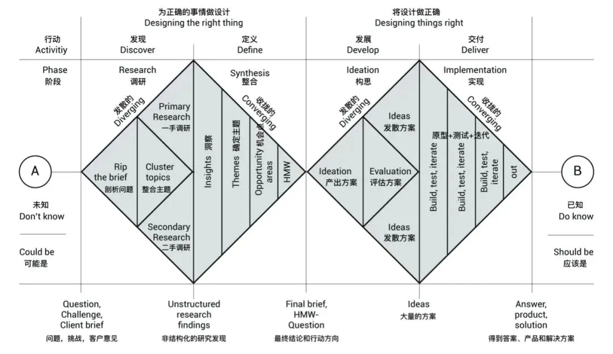

We use the dual drill model to manage the entire project: conducting research ->determining themes ->identifying opportunities ->generating game plans ->producing prototypes through coding and other processes. We optimize the project through testing iterations.

---

### Contribution

We are happily announcing that our distribution among all members are even:

| Contributor | Contribution |
|:------------|:-------------|
| Zewen Liang | 20% |
| Yunhao Zhou | 20% |
| Yuying Zhang | 20% |
| Zhi Zhao | 20% |
| Kaijie Xu | 20% |

> *"Again, not all members are good at coding, but we are all doing what we are good at, this is the perfect status for a team."*

> *"Congrats! You have gone through all our journey of game development!"*